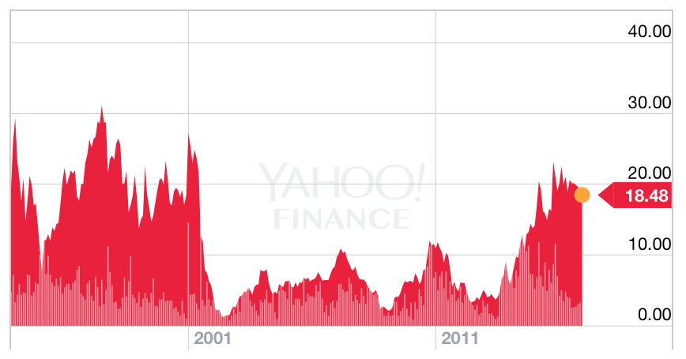

Argentina 2001
---------------

## Por qué es un activo estratégico

Argentina es un mercado grande con alto crecimiento demográfico y es  un importante  proveedor de commodities. Su PBI está por encima del PBI promedio del mundo (es el tercero de Latinoamérica). Además es el país #8 en superficie  y el #32 en cantidad de habitantes del mundo. Su inestabilidad amenaza al sistema económico latinoamericano y por lo tanto a los mercados emergentes.

## Por qué es un activo inestable

Las instituciones argentinas son extractivas. La libertad económica es muy baja y la concentración de riesgo es muy alta. Tiene un track record de no respetar contratos.

### Complejidad económica

  
  

Más del 50% de las exportaciones son de productos minerales o animales con poco valor agregado. 60% de lo que exporta va a países emergentes, con concentración en Brasil y China.

  

  

### Libertad económica

  

  

### Monitoreo de indicadores

##### Balance macro

Argentina acumula reservas y sostiene su régimen cambiario de convertibilidad. Tiene un déficit de cuenta corriente bastante más alto que el promedio del mundo, y hay una tendencia bajista en la riquieza por habitante.

El deficit fisco congénito se logra controlar en el principo de la década del 90. Pero al acercarse al período eleccionario, comienza a subir hasta llegar al 6%, en un contexto de flexibilidad monetaria muy baja.

##### Excange rate: 
El tipo de cambio fijo se rompe, produciendo una devaluación.Anteriormente, oscilaba en 250 (momento de la convertibilidad), hasta que baja a 100 y de ahí se deprecia.

##### Carry: 
El tipo de cambio fijo se rompe, produciendo una devaluación.Anteriormente, oscilaba en 250 (momento de la convertibilidad), hasta que baja a 100 y de ahí se deprecia.

##### CDS: 
El seguro de default de Argentina es bajo al igual que todos los de la región. Esto producto de las acciones anticíclicas de los mercados desarrollados para evitar un contagio de la crisis asiática y la crisis de las 'dot-com'.

##### Endeudamiento: 
Antes de la crisis el endeudamiento sube a fines de la década del 90. La deuda se dispara por el cambio en el tipo de cambio real.

### Valor duro de los activos

El price to book de las acciones argentinas es en general 1.5x

Durante la crisis el  price to book está por debajo de 1x. (La primer parte del PB es probablemente un error de data, pero el valor de equilibrio de todas maneras era al menos 1x).

## Análisis de opcionalidad

Opción A

Si el trade se hace a un Earnings Yield de 20% o más hay un devengamiento importante. Si ajusta a una tasa de 10x a 15z entonces hay una ganancia de capital, que se suma a la revalorización del equity de las compañías.
Véase el el período en el que el EY es cero; en este momento hay grandes posibilidades de un cambio de paradigma.

Opción B

Cambio de paradigma. Argentina se estanca, disminuye su crecimiento demográfico por falta de incentivos, el endeudamiento no se resuelve.
Las compañías no pagan dividendos y hay un write-off en el valor libros de las empresas y en su deuda.

Opción C

Argentina no es viable como país. El riesgo de quiebra o confiscación se hace realiad, y los únicos de activos son fondos de deep-distress que tienen la capacidad de litigar o asociarse con el gobierno.

Banco Francés pierde más del 90% de su valor

Telecom casi llega a un precio de cero

## Retorno de la inversión

Como el punto de entrada no es preciso, calculamos distintos retorno para diferentes puntos de entrada y puntos de salida.

En este gráfico se ve el retorno de la inversión a 1, 3 y 5 años. Este gráfico se lee así: 'si entré en el 2002, un año después estoy perdiendo plata (la línea roja está debajo de cero). Tres años después (línea verde) estoy arriba (1x). Cinco años después (línea azul ) el trade multiplicó por 2.5x'.

Esperando a que el price to book esté debajo de 1x - y un poco más el retorno es bastante bueno porque la opcionalidad tuvo un precio bajo.el mínimo de price to book fue menor a 0.5x y la re-estructuración de deuda fue el salvataje del sistema financiero. En el medio, el paradigma de Argentina como pais viable sufrió grandes dudas y la certeza de que desapareciera su valor fue muy alta. Esto está reflejado por el drawdown, que inclusive haciendo una multiplpicación de 10x es cercano al 50%.

