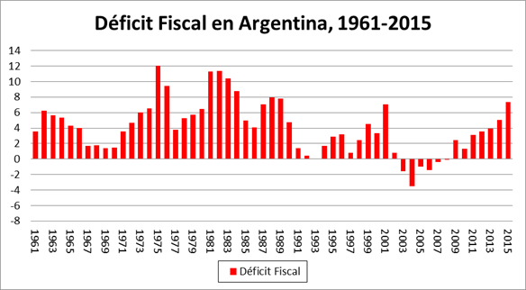

```{r setup, include=FALSE}
library(tint)
# invalidate cache when the package version changes
knitr::opts_chunk$set(tidy = FALSE, cache.extra = packageVersion('tint'))
options(htmltools.dir.version = FALSE)
knitr::opts_chunk$set(echo = FALSE)
knitr::opts_chunk$set(message = FALSE)

```

# Antes de empezar...
Este análisis fue hecho 15 años después del evento. Por lo tanto, tiene 'look-ahead' bias. Tiene como fin mostrar un procedimiento de análisis.

```{r fig-nocap-margin-first, fig.margin=TRUE, fig.width=4, fig.height=4, cache=TRUE, echo=FALSE}
library(ggplot2)
# ggplot(mtcars, aes(wt, mpg)) + geom_point(size=3, aes(colour=factor(cyl))) + theme(legend.position="none")

```
# Por qué Argentina es un activo con valor estratégico
Argentina tiene un mercado grande con alto crecimiento demográfico y es un importante proveedor de commodities. Es el país #8 en superficie y el #32 en cantidad de habitantes del mundo. Su PBI está por encima del PBI promedio del mundo (es el tercero de Latinoamérica). Su inestabilidad amenaza al sistema económico latinoamericano y por lo tanto a los mercados emergentes.

# Por qué Argentina es un activo inestable

Las instituciones argentinas son extractivas y su libertad económica es baja.


La facilidad para hacer negocios es promedio


Este score se divide en subtemas, que son los siguientes:

```{r doing business sub scores}
library(dplyr)
db_themes <- read.csv('images/argie_macro/doing_business_components/Sheet 4-Table 1.csv')
knitr::kable(
  db_themes, caption = 'Sub-componentes del score de facilidad para hacer negocios.'
)
```

Argentina tiene una presión fiscal de 106%. En Latino-américa y el Caribe es de 46%, y en los países de la OCDE es de 41%. [Link al informe](http://espanol.doingbusiness.org/data/exploreeconomies/argentina#paying-taxes)


```{marginfigure}
Presión impositiva implica no sólo impuestos directos, sino también aportes mandatorios a seguridad social, jubilaciones, etc...

```

# El riesgo de concentración es relativamente alto.


El índice de complejidad económica de Argentina es de 45 sobre 170, y es el segundo país más complejo de sud-américa después de Brasil. 

`r margin_note("El índice de complejidad económica usa datos de comercio exterior para reflejar el conocimiento productivo de cada país.")`


# Monitor macroeconómico y financiero
El tipo de cambio se aprecia fuertemente contra el de los socios comerciales. Especialmente contra Brasil, quien antes de la crisis hace una devaluación que deja a Argentina en una situación de muy poca competitividad. Durante la crisis el tipo de cambio - que en promedio es 100 - pasa de  50 a 160.


Luego del primer tramo de la década del '90 - sin el cash obtenido por las privatizaciones - aumenta el déficit fiscal, el que se financia a través de deuda en dólares.




El factor externo, la falta de flexibilidad cambiaria y el gasto político contribuyen a un desbalance de la balanza de pagos.


El crecimiento del PBI se detiene,reduciendo la capacidad recaudatoria y, sumado al tipo de cambio alto, hacen que el país esté al borde de la insolvencia.


# Valor intrínseco

```{r fig-val-int, fig.margin = FALSE, fig.cap = "Valor libros de la bolsa (error estadístico hasta el 2002).", cache=TRUE}
 case <- readRDS('output.RDS') %>% tbl_df() %>% filter(name == 'Argentina')

ggplot(case %>% filter(unique_variable == 'Argentina PB'), aes(date, value)) +
  geom_line(stat = 'identity') +
  theme(legend.position = 'bottom') + theme_wsj(color = 'white')
```

