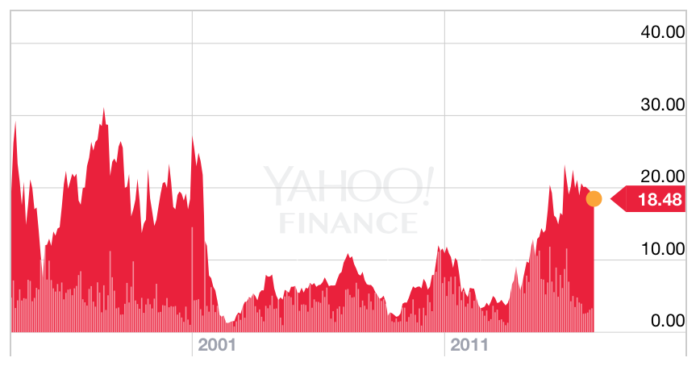
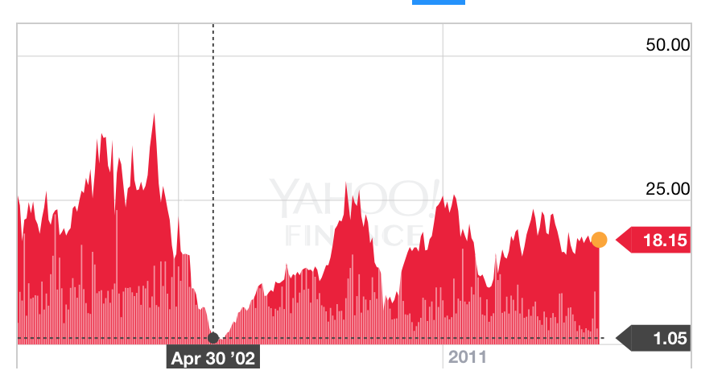

```{r setup3, include=FALSE}
library(tint)
# invalidate cache when the package version changes
knitr::opts_chunk$set(tidy = FALSE, cache.extra = packageVersion('tint'))
options(htmltools.dir.version = FALSE)
knitr::opts_chunk$set(echo = FALSE)
knitr::opts_chunk$set(message = FALSE)
knitr::opts_chunk$set(warning = FALSE)
```
# Análisis de opcionalidad


## Opción A

Si el trade se hace a un Earnings Yield de 20% o más hay un devengamiento importante. Si ajusta a una tasa de 10x a 15z entonces hay una ganancia de capital, que se suma a la revalorización del equity de las compañías. Véase el el período en el que el EY es cero; en este momento hay grandes posibilidades de un cambio de paradigma.

## Opción B
Cambio de paradigma. Argentina se estanca, disminuye su crecimiento demográfico por falta de incentivos, el endeudamiento no se resuelve. Las compañías no pagan dividendos y hay un write-off en el valor libros de las empresas y en su deuda.

## Opción C
Argentina no es viable como país. El riesgo de quiebra o confiscación se hace realiad, y los únicos de activos son fondos de deep-distress que tienen la capacidad de litigar o asociarse con el gobierno.

## Riesgo del trade

El riesgo de este sistema NO ES el riesgo estadístico. Es parte del trade ver las máximas caídas que se ven en este gráfico, dependiendo del momento de entrada.


```{r fig-val-mdd, fig.margin = FALSE, fig.cap = "Máxima caída del precio de la bolsa", cache=TRUE}
library(dplyr)
library(ggplot2)
library(ggthemes)
 case <- readRDS('output.RDS') %>% tbl_df() %>% filter(name == 'Argentina')

ggplot(case %>% filter(unique_variable == 'Argentina Price | DrawDown'), aes(date, value)) +
  geom_line(stat = 'identity') +
  theme(legend.position = 'bottom') + theme_wsj(color = 'white')
```

# Resultados posibles


```{r resultados_posibles, fig.margin = FALSE, fig.cap = "En este gráfico se ve el retorno de la inversión a 1, 3 y 5 años. Este gráfico se lee así: si entré en el 2002, un año después estoy perdiendo plata (la línea roja está debajo de cero). Tres años después (línea verde) estoy arriba (1x). Cinco años después (línea azul ) el trade multiplicó por 2.5x.", cache=TRUE, fig.width=4, fig.height=8}
library(dplyr)
library(ggplot2)
library(ggthemes)
pnl_vars <- c('Argentina Price | TR_5y','Argentina Price | TR_3y','Argentina Price | TR_1y')
 case <- readRDS('output.RDS') %>% tbl_df() %>% filter(name == 'Argentina')

ggplot(case %>% filter(unique_variable %in% pnl_vars), aes(date, value)) +
  geom_line(stat = 'identity') + facet_wrap(~unique_variable, ncol = 1)  + theme_wsj(color = 'white')
```

Esperando a que el price to book esté debajo de 1x - y un poco más el retorno es bastante bueno porque la opcionalidad tuvo un precio bajo.el mínimo de price to book fue menor a 0.5x y la re-estructuración de deuda fue el salvataje del sistema financiero. En el medio, el paradigma de Argentina como pais viable sufrió grandes dudas y la certeza de que desapareciera su valor fue muy alta. Esto está reflejado por el drawdown, que inclusive haciendo una multiplpicación de 10x es cercano al 50%.

En los siguientes gráficos se ve el caso aplicado a Banco Francés y Telecom. Más allá de la diversificación, el producto y el management, ambos activos casi llegan a cero.





