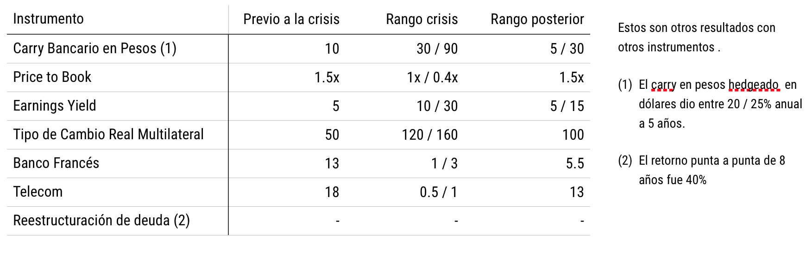

```{r setup0, include=FALSE}
library(tint)
# invalidate cache when the package version changes
knitr::opts_chunk$set(tidy = FALSE, cache.extra = packageVersion('tint'))
options(htmltools.dir.version = FALSE)
knitr::opts_chunk$set(echo = FALSE)
knitr::opts_chunk$set(message = FALSE)
library(ggplot2)
library(ggthemes)

```

# Antes de empezar...
   
Este análisis fue hecho 15 años después del evento. Por lo tanto, tiene 'look-ahead' bias. Tiene como fin mostrar un procedimiento de análisis.

# Por qué Argentina es un activo con valor estratégico
  
Argentina tiene un mercado grande con alto crecimiento demográfico y es un importante proveedor de commodities. Es el país #8 en superficie y el #32 en cantidad de habitantes del mundo. Su PBI está por encima del PBI promedio del mundo (es el tercero de Latinoamérica). Su inestabilidad amenaza al sistema económico latinoamericano y por lo tanto a los mercados emergentes.

# Por qué Argentina es un activo inestable
  
Las instituciones argentinas son extractivas y su libertad económica es baja.

 
  
La facilidad para hacer negocios es promedio


  

Este score se divide en subtemas, que son los siguientes:


```{r doing business sub scores}
library(dplyr)
db_themes <- read.csv('images/argie_macro/doing_business_components/Sheet 4-Table 1.csv')
knitr::kable(
  db_themes, caption = 'Sub-componentes del score de facilidad para hacer negocios.'
)
```

Argentina tiene una presión fiscal de 106%. En Latino-américa y el Caribe es de 46%, y en los países de la OCDE es de 41%. [Link al informe](http://espanol.doingbusiness.org/data/exploreeconomies/argentina#paying-taxes)
  
(Presión impositiva implica no sólo impuestos directos, sino también aportes mandatorios a seguridad social, jubilaciones, etc...)

  
# El riesgo de concentración es relativamente alto.
  
El índice de complejidad económica de Argentina es de 45 sobre 170, y es el segundo país más complejo de sud-américa después de Brasil. 
  
  
  
  
  
********
  
# Monitor macroeconómico y financiero
  
El tipo de cambio se aprecia fuertemente contra el de los socios comerciales. Especialmente contra Brasil, quien antes de la crisis hace una devaluación que deja a Argentina en una situación de muy poca competitividad. Durante la crisis el tipo de cambio - que en promedio es 100 - pasa de 50 a 160.  


  

Luego del primer tramo de la década del '90 - sin el cash obtenido por las privatizaciones - aumenta el déficit fiscal, el que se financia a través de deuda en dólares.
  

  


  


  

El factor externo, la falta de flexibilidad cambiaria y el gasto político contribuyen a un desbalance de la balanza de pagos.  
  
El crecimiento del PBI se detiene,reduciendo la capacidad recaudatoria y, sumado al tipo de cambio alto, hacen que el país esté al borde de la insolvencia.  


  
***
  
# VALOR INTRINSECO
  
```{r fig-val-pb, fig.margin = FALSE, fig.cap = "Valor libros de la bolsa (error estadístico hasta el 2002).", cache=FALSE}
library(ggthemes)
 case <- readRDS('output.RDS') %>% tbl_df() %>% filter(name == 'Argentina')

ggplot(case %>% filter(unique_variable == 'Argentina PB'), aes(date, value)) +
  geom_line(stat = 'identity') +
  theme(legend.position = 'bottom') + theme_wsj(color = 'white')
```
  
```{r fig-val-pe, fig.margin = FALSE, fig.cap = "Price Earnings de la bolsa.", cache=FALSE}

ggplot(case %>% filter(unique_variable == 'Argentina PE'), aes(date, value)) +
  geom_line(stat = 'identity') +
  theme(legend.position = 'bottom') + theme_wsj(color = 'white')
```
  
```{r fig-val-ep, fig.margin = FALSE, fig.cap = "Earnings Yield de la bolsa.", cache=FALSE}
ggplot(case %>% filter(unique_variable == 'Argentina PE'), aes(date, value)) +
  geom_line(stat = 'identity') +
  theme(legend.position = 'bottom') + theme_wsj(color = 'white')
```
  
```{r fig-val-carry, fig.margin = FALSE, fig.cap = "Carry bancario en moneda local (Badlar).", cache=FALSE}

ggplot(case %>% filter(unique_variable == 'Argentina BADLAR'), aes(date, value)) +
  geom_line(stat = 'identity') +
  theme(legend.position = 'bottom') + theme_wsj(color = 'white')
```
  
*****
  
# ANALISIS DE OPCIONALIDAD


## Opción A

Si el trade se hace a un Earnings Yield de 20% o más hay un devengamiento importante. Si ajusta a una tasa de 10x a 15z entonces hay una ganancia de capital, que se suma a la revalorización del equity de las compañías. Véase el el período en el que el EY es cero; en este momento hay grandes posibilidades de un cambio de paradigma.

## Opción B
Cambio de paradigma. Argentina se estanca, disminuye su crecimiento demográfico por falta de incentivos, el endeudamiento no se resuelve. Las compañías no pagan dividendos y hay un write-off en el valor libros de las empresas y en su deuda.

## Opción C
Argentina no es viable como país. El riesgo de quiebra o confiscación se hace realiad, y los únicos de activos son fondos de deep-distress que tienen la capacidad de litigar o asociarse con el gobierno.

## Riesgo del trade

El riesgo de este sistema NO ES el riesgo estadístico. Es parte del trade ver las máximas caídas que se ven en este gráfico, dependiendo del momento de entrada.


```{r fig-val-mdd, fig.margin = FALSE, fig.cap = "Máxima caída del precio de la bolsa", cache=TRUE}
library(dplyr)
library(ggplot2)
library(ggthemes)
 case <- readRDS('output.RDS') %>% tbl_df() %>% filter(name == 'Argentina')

ggplot(case %>% filter(unique_variable == 'Argentina Price | DrawDown'), aes(date, value)) +
  geom_line(stat = 'identity') +
  theme(legend.position = 'bottom') + theme_wsj(color = 'white')
```

# RESULTADOS POSIBLES


```{r resultados_posibles, fig.margin = FALSE, fig.cap = "En este gráfico se ve el retorno de la inversión a 1, 3 y 5 años. Este gráfico se lee así: si entré en el 2002, un año después estoy perdiendo plata (la línea roja está debajo de cero). Tres años después (línea verde) estoy arriba (1x). Cinco años después (línea azul ) el trade multiplicó por 2.5x.", cache=TRUE, fig.width=4, fig.height=8}
library(dplyr)
library(ggplot2)
library(ggthemes)
pnl_vars <- c('Argentina Price | TR_5y','Argentina Price | TR_3y','Argentina Price | TR_1y')
 case <- readRDS('output.RDS') %>% tbl_df() %>% filter(name == 'Argentina')

ggplot(case %>% filter(unique_variable %in% pnl_vars), aes(date, value)) +
  geom_line(stat = 'identity') + facet_wrap(~unique_variable, ncol = 1)  + theme_wsj(color = 'white')
```

Esperando a que el price to book esté debajo de 1x - y un poco más el retorno es bastante bueno porque la opcionalidad tuvo un precio bajo.el mínimo de price to book fue menor a 0.5x y la re-estructuración de deuda fue el salvataje del sistema financiero. En el medio, el paradigma de Argentina como pais viable sufrió grandes dudas y la certeza de que desapareciera su valor fue muy alta. Esto está reflejado por el drawdown, que inclusive haciendo una multiplpicación de 10x es cercano al 50%.

En los siguientes gráficos se ve el caso aplicado a Banco Francés y Telecom. Más allá de la diversificación, el producto y el management, ambos activos casi llegan a cero.


Además hubieron otras alternativas de explotar la situación especial:



