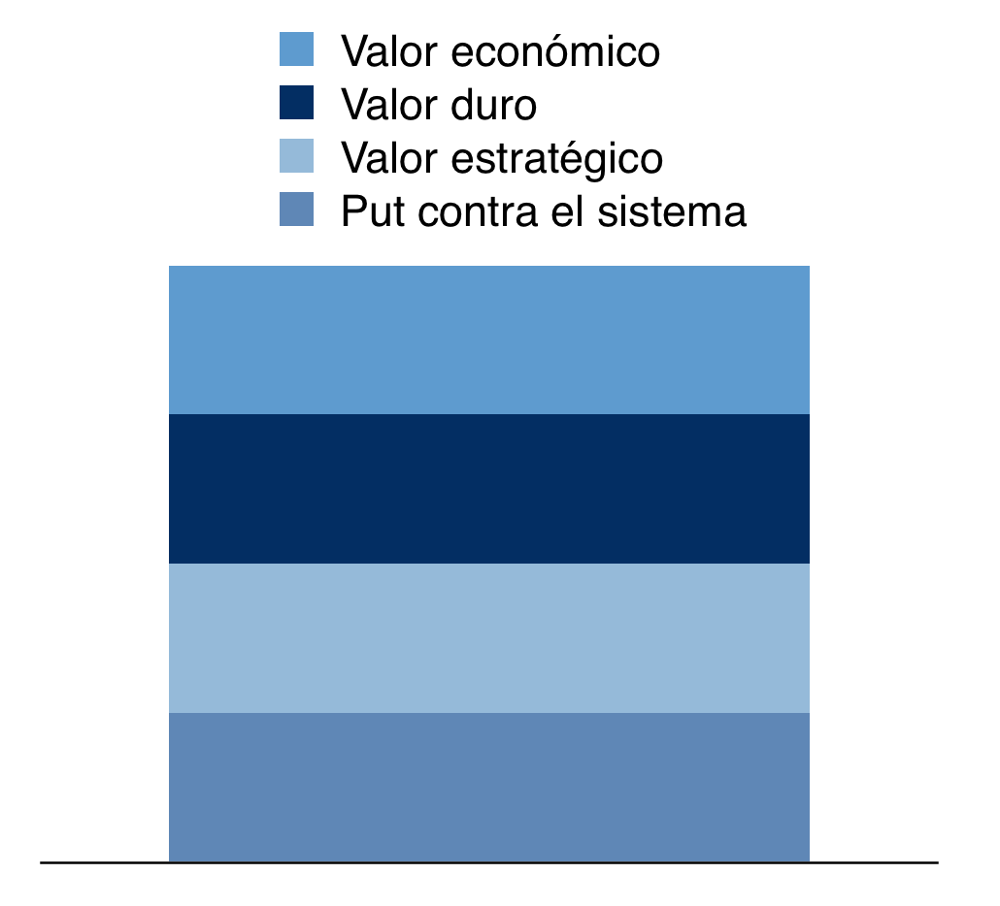
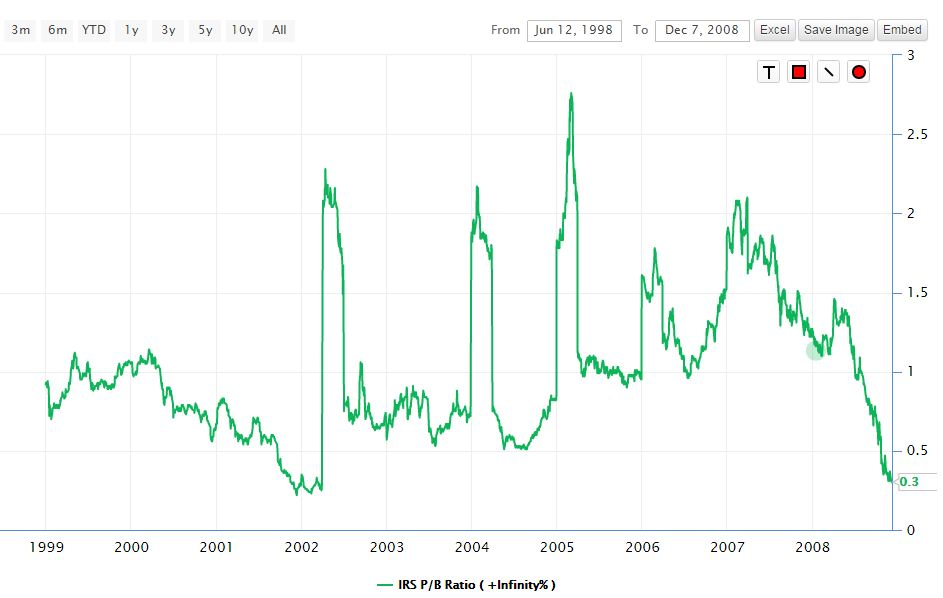

```{r setup, include=FALSE}
library(tint)
# invalidate cache when the package version changes
knitr::opts_chunk$set(tidy = FALSE, cache.extra = packageVersion('tint'))
options(htmltools.dir.version = FALSE)

```


# Resumen de la estrategia

‘Situaciones Especiales’  es una estrategia pro-sistémica. Consiste en comprar activos de importancia estratégica en momentos de pánico, yendo en contra del consenso de mercado. Estos activos  cuya vulnerabilidad los lleva a sufrir crisis recurrentes, son casi siempre rescatados por el sistema capitalista para evitar contagios  que  pongan en peligro al sistema económico mundial. Luego de pasar por esas crisis vuelven a  un valor de equilibrio y siguen devengando las prima de mercado ajustada por riesgo. Esta filosofía de inversión ‘convergente’^[En una estrategia convergente hay un precio de equilibrio que se sabe de antemano. Cuando el precio se aleja del valor de equlibrio, tiene que volver a él.
En una estrategia divergente, el precio de equilibrio es desonocido. Si un precio se aleja del equilibrio, puede tanto volver como buscar uno nuevo.] es un negocio de probabilidad positiva, y agrega diversificación al portafolio.
El retorno anualizado esperado es de 10%, y el capital asignado es un 10% del portafolio.

# Activos de importancia estratégica

Los activos de importancia estratégica:

* representan grandes mercados potenciales (Latinoamérica);
* los gobiernos dependen de ellos para no caer en crisis (petróleo en Malasia, Venezuela y Nigeria);
* ocupan un lugar central en la industria (cobre / Chile);
* su valor impacta en grandes masas demográficas (economía de Indonesia, India y Méjico) ;
* o generan un riesgo alto de contagio mercados  de capital centrales (economía de India y China).

En el sistema capitalista funciona una red de contención compuesta por  instituciones formales  e informales.^[El principal integrante de esa red es el gobierno americano, a través del Tesoro (como  Robert Rubin y el PPT en los 90) y por supuesto la Fed. Luego están el resto de las autoridades monetarias de países desarrollados y finalmente los organismos políticos multinacionales como ,el FMI, la OCDE , el G10, el grupo de Davos, la OPEC, y otros. En momentos de crisis - y en especial sison crisis sistémicas - esta red intenta preservar los activos de importancia estratégica a través de rescates económicos y financieros: Latino-américa en los 80, Asia 90, Rusia 98, lasdot.com en los 2000, el plan Marshall en la segunda guerra, el plan Brady, la crisis financiera en el 2008, Grecia 2010, las 'Savings & Loans' de los '80, la OPEC en el 2016. El valor de estos activos depende directamente de la efectividad que tenga el sistema para preservarlos.  

Estos activos son de mala calidad si se los analiza desde la perspectiva del ‘value tradicional’ (que busca retornos altos sobre el patrimonio  con flujos de caja  constantes y estables). Además, las jurisdicciones donde operan  están manejadas por instituciones extractivas.^[Son empresas e instituciones extractivas porque tienen como objetivo extraer recursos, rentas y riqueza de un subconjunto de la sociedad para beneficiar a un subconjunto distinto (link). ] 

Como las ganancias y los flujos son totalmente impredecibles, la estimación de valor se hace con indicadores más duros y más simples. Los principales indicadores para monitorear posibles situaciones especiales son:

* el descuento del valor libros / costo de reposición para acciones;
* la alta tasa de retorno de varios bonos^[Un sólo bonostiene opcionalidad negativa para el inversor: la fuerza de los rescates no aplica a situaciones individuales (Lehman).] de una industria o región, neto de defaults y de recupero ; 
* el nivel del tipo de cambio real multilateral y tasas de interés para hacer el ‘carry trade’;
* y los precios de indiferencia de extracción de commodities.


La idea principal es invertir cuando haya un muy  fuerte desvío de los indicadores con respecto a su nivel histórico y con respecto al nivel adecuado para la toma de riesgo empresario.^[Los niveles de equilibrio son la prima en términos reales  de mercados desarrollados: 0.8%, 1.8% y 5% para bonos cortos, bonos largos y acciones respectivamente. Para mercados emergentes las primas son mayores por el riesgo de concentrar en una idea poco diversificada. Para empresas que están en etapa previa a ser públicas, el retorno tiene que ser 20% aprox. para que sea razonable ese riesgo empresario.]  

A diferencia de las estrategias de primas de mercado, en donde buscamos un nivel de entrada promedio, en esta estrategia buscamos un nivel de entrada con  mucho descuento. El descuento es sobre un valor intrínseco que ya no es 100% indiscutido. Pero cuando la red de contención interviene, el regreso al valor promedio es a muy alta velocidad para volver a su valor intrínseco y así devengar las primas de mercado. Pero al igual que las estrategias de mercado, el objetivo no es multiplicar el capital rápidamente, por eso el objetivo de retorno del 10%.

# Composición del valor intrínseco

El valor intrínseco de esta clase de activos tiene cuatro componentes, que son (en orden de menor a mayor opcionalidad):  
  
* Un ‘valor libros’. Este es su valor ‘duro’: su hoja de balance, su PPE^[Propiedad, planta y equipo], licencias, marcas, intangibles, el valor de los claims y otros. 
* Un ‘valor económico’ por el free cash-flow que genera y su crecimiento, más la prima de mercado de acuerdo a su concentración  (e.g. mercados emergentes que dependen de commodities).
* Un 'valor estratégico': el valor demográfico, geopolítico, de crecimiento y de innovación.
* Un ‘put’ que representa el compromiso del mercado de capitales a salvarlo si sufriera una crisis que ponga en riesgo el sistema capitalista



# Timeline de la inversión

 
El precio del activo oscila por alrededor del valor intrínseco, que el que remunera el riesgo empresario ajustado por el riesgo de concentración.  
  
    
```{marginfigure }
En el momento de crisis SI EXISTE el riesgo de un cambio de paradigma, y que el valor intrínseco anterior desaparezca. Los salvatajes funcionan en general, pero no el 100% de las veces.
```


Cuando el precio perfora el valor ‘duro’ comienza una crisis y luego se produce pánico, porque la posibilidad de un cambio de paradigma es cierta.En el pánico el consenso del mercado exacerba la tendencia bajista y se desprende del activo. Todos tratan de vender al mismo tiempo y no hay liquidez. Es en este momento que el inversor 'convergente' se pone del otro lado y compra el activo cobrando la prima de iliquidez. ^[En este momento de pánico los inversores ‘convergentes’ compran porque su análisis los lleva a creer que el consenso está equivocado. El convergente busca un punto de entrada luego de que se produzcan exageraciones en los indicadores que monitorea. La paciencia para esperar el correcto punto de entrada es fundamental para evitar tomar decisiones usando como dato solamente los precios inmediatos anteriores (recency bias). ] 
  
  
***  
# Opcionalidad  
  
Una vez ejecutada la decisión de invertir, los resultados pueden ser tres:
  
```{r fig.cap = "Una vez ejecutada la decisión de invertir, los resultados pueden ser tres: (A) Rescate, (B) Value Trap y (C) Quiebra.", echo=FALSE}
library(ggplot2)
library(directlabels)
x <- data.frame(caso = c('A','A','A','B','B','B','C','C','C'),
                tiempo = c(0,1,2,0,1,2,0,1,2),
                valor = c(0,-50,150,0,-60,-20,0,-80,-100))
options <- ggplot(x, aes(x = tiempo, y = valor, color = caso)) +
  geom_line() + theme_minimal() 
direct.label(options)
```


- (A) RESCATE. El activo es rescatado por el sistema capitalista mundial: 
aceleración hacia el valor de equilibrio anterior directa o indirecta. En este caso se ejerció el put. El precio vuelve a la tendencia anterior a la crisis, y esto hace que la aceleración del retorno sea muy alta (pendiente de la línea A). Antes de eso es probable que el trade sufra un ‘drawdown’ importante, por lo que es una posición difícil de sobrellevar. El consenso piensa lo opuesto de lo que piensa el ‘convergente’ y su presión es muy grande.

- (B) VALUE TRAP: el activo se estabiliza en un nuevo nivel de equilibrio que es más bajo que el anterior. Es probable que no haya retorno o que haya pérdidas. Para evitar una pérdida completa se puede diversificar las activos, a costa de resignar la opcionalidad de multiplicar más veces el retorno.

- (C) QUIEBRA: El trade quiebra y pierde el 100% de su valor.^[Mirar gráficos de crisis es engañoso: los precios de las acciones siguen graficándose pero el valor de los accionistas originales puede ser cero. Ejemplos: Grecia y Chipre, actualmente, están en un 90% de pérdida. Lo mismo para los inversores de bancos en el 2008 ( y especialmente hoy que Europa no quiere repetir un 'bail-out'), o para los jubilados italianos en el default argentino]
  
  
Si se da el escenario de Salvataje (Caso A), entonces vemos que la mejor opción es esperar: cuanto más lejos del valor de equilibrio más es la chance de tener un buen resultado porque mayor es la volatilidad a favor. Para poder tomar esta opción hay que sostener una actitud de inversión ‘convergente’ o contra el consenso, en el momento más crítico de la vida del activo. Ese momento es donde hay más necesidad psicológica de unirse al consenso y donde es más difícil ser convergente.
 

# La aceleración de la opcionalidad

```{marginfigure }
Ejemplo de situaciones especiales en Estados Unidos.


En 1980 con la crisis de S&L - institución financiera de ahorro y préstamo] -, la tierra valía $2000 el acre.Un acre producía 120 bushels de main o 45 bushels de poroto de soja. A un par de dólares el bushell, esto era básicamente $80 por acre en ventas. En ese momento, por el nivel de tasa uno pagaba $150 por acre en intereses. O sea, estaba recibiendo $80 y pagando $150. No tenía sentido. Los banqueros no paraban de dar créditos a l 10% a una valuación de $2000 el acre para producir $80 de cosecha.
Luego de que una gran cantidad de personas perdiera mucho dinero, la FDIC Corporación Federal de Seguro de Depósitos— tomó control de las granjas y terminó vendiéndolas a $600 el acre, que en ese momento era un buen negocio. La FDIC se hizo cargo de cientos de granjas porque la gente se volvió loca y perdió hasta lo que no tenía.
Los S&L abandonaron su ‘fundamentals’ y el Gobierno se hizo dueño de $100 millones de propiedades que tenían que vender a bajo costo.Esta fue una oportunidad especial para hacer dinero.
```


Los salvatajes financieros aceleran la vuelta al nivel de primas de retorno promedio, de la misma manera que las crisis aceleran la posibilidad de un  cambio de paradigma. Cuanta más paciencia se tenga para esperar  los momentos de riesgo de concentración e iliquidez, mayor es el rédito de este sistema.

Esto es así porque hay crisis que son tan profundas que el abandono del paradigma anterior es una certeza  para el consenso. El inversor convergente es el único que cree en la posibilidad de una vuelta al estado anterior. Cuanto más seguro está de su análisis más puede afrontar el pánico del consenso. A mayor descuento mayor aceleración posterior y mayor opcionalidad a favor. Este sistema no tiene que ver con devengar primas de mercado: tiene que ver con aprovechar la red del contención  del sistema capitalista.


# Alocación dentro del portafolio

Algunos trades ganadores multiplican su capital de manera de cubrir los trade de quiebra y los value trap. No es una estrategia para aplicar al mucho  capital: el costo emocional de ser convergente es muy alto y genera  problemas de governance, las caídas son muy visibles (aunque se escoja hacer ‘mark to model’) y la alineación con el management es opuesta a los intereses del inversor (por la misma opcionalidad que la explota). Sin embargo, aprovechar rescates sistémicos es una  fuente válida de retorno y difiere conceptualmente con el resto de las estrategias, por lo tanto es bueno sumarla a un  portafolio de otras ideas.

La propuesta es destinar un 10% del total del portafolio. Mientras no haya situaciones que explotar, el capital destinado a la estrategia permanecerá en el resto del portafolio.
Esperamos que cada trade madure en períodos largos - 3 años o más - culminando cuando el gap entre el precio de mercado y el valor intrínseco de los activos vuelva a un nivel de equilibrio, sea el nivel pre-crisis o uno nuevo. La única excepción es si la velocidad de recupero de un  trade ganador es muy alta . En ese caso, el capital del trade se asignará a un mejor uso.

La alocación de capital a cada trade dependerá de las expectativas de riesgo / retorno de la situación especial. En general, la alocación será más grande, si el descuento contra el valor duro es muy importante y  si la convicción sobre la idea es alta . También influye la alta o baja complejidad económica de la situación.

# Control de riesgo

El control de riesgo no es estadístico y al ser activos listados la valuación ‘mark  to market’ va a ser muy variable sobre todo al inicio de cada posición. Por eso es mejor pensar en ellos como en un negocio de  valuación “mark to model” (seguimiento de las premisas de flujos y no de los precios). 
Las medidas de máxima caída o volatilidad no deben usarse y frente a la ausencia de control sistemático de riesgo es importante apoyarse en la robustez y la simpleza del análisis para soportar los momentos de pérdidas. Aumenta el riesgo del portafolio medido como máxima caída y aumenta el riesgo de correlación estadística entre estrategias porque el máximo stress se dará al mismo tiempo que el resto de las estrategias de mercado. Creemos que la máxima caída puede aumentar en un 5%.

***

# APENDICE: REAL ESTATE EN ARGENTINA, el caso de IRSA

En la década del 90, IRSA era la mejor opción para invertir en RE en Argentina:

* Tenía inversores y managers especializados
* diversificaba entre RE comercial y residencial
* Tenía muchos proyectos en muchos barrios y provincias
* Tenía acceso de capitales
* No tenía  alto apalancamiento
* Tenía de socio a George Soros,Sam Zell -uno de los cinco mayores propietarios de inmuebles de los Estados Unidos.


Sin embargo, no funcionó. ^[El retorno fue de 1% anual, con una caída de más del 90%.] Por qué IRSA no eligió los mejores barrios de Argentina? Por qué no concentró en un barrio o en un segmento, si hacerlo era un buen negocio? No tenía la capacidad de análisis necesaria?

Dando vuelta la pregunta, el que invirtió en un sólo edificio y multiplicó su capital: cómo hizo para superar la capacidad de hacer negocios de IRSA? Cómo pudo ser mejor alocando capital, tomando riesgo iliquidez y riesgo de  concentración?

En mercados de economías extractivas, la capacidad de hacer negocios es mucho menos predecible. Es mucho menos dependiente del management, de las marcas y de las barreras de a la competencia. El riesgo sistémico es mucho más protagonista a la hora de estimar si el negocio va a ser bueno o no.
Este es un caso que refleja un trade de tipo VALUE TRAP. Por eso es que hay que buscar varias situaciones especiales, no concentrar, esperar el momento adecuado y anclar la inversión a los ‘fierros’ (en este caso ladrillos).

```{r irsa, echo=FALSE}
irsa <- read.csv('../argentina 2001/precios_irsa.csv', sep= '\t')
irsa$Date <- as.Date(irsa$Date)
library(ggplot2)
library(ggthemes)
ggplot(irsa, aes(Date, IRSA)) +
  geom_line() + theme_wsj(color = 'white')


```

Sin embargo, si la tomamos como situación especial, entonces podemos analizar el precio contra el valor libros y el valor intrínseco de IRSA. El sistema salvó a la compañía varias veces, pero la posibilidad de cambio de paradigma fue muy alta, generando riesgo de concentración, liquidez y convergencia. La posibilidad de comprarla a valor libros estuvo varias veces. 



Este margen de seguridad alto es justificado. El gráfico muestra grandes saltos en el ratio precio / valor libros. Esto indica la fragilidad del balance y de los flujos. Pero si el valor 'duro' existía y estimamos que tiene un put a favor, es un buen negocio.