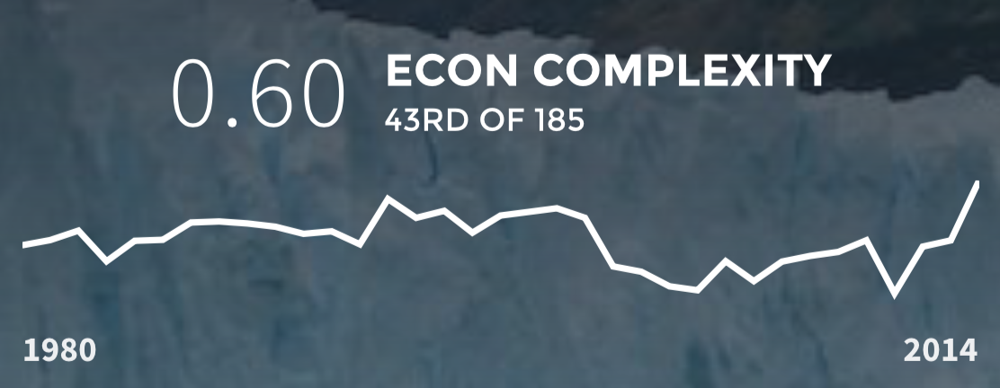
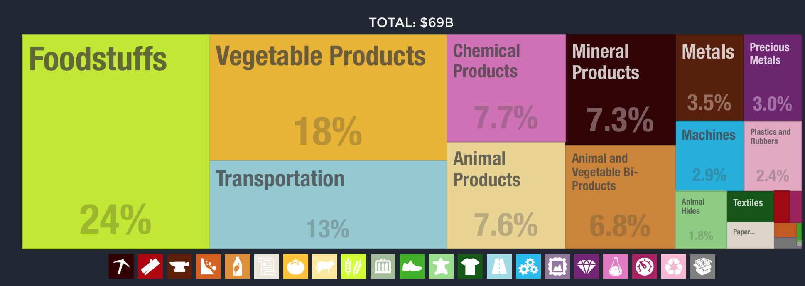
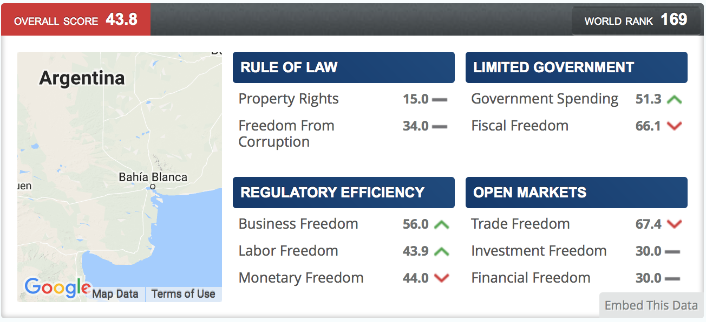
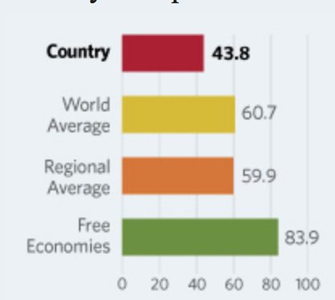
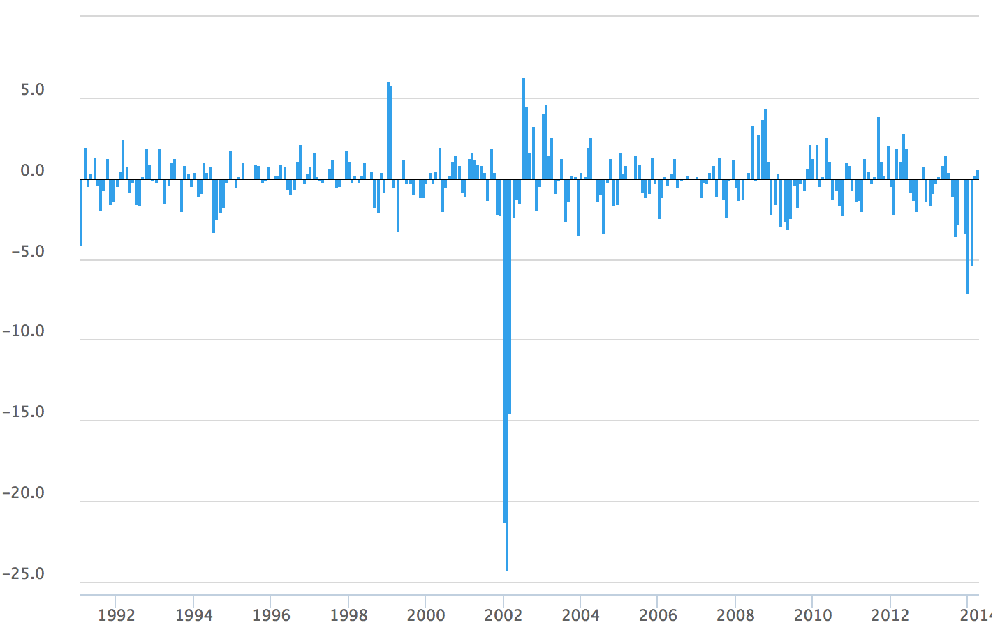
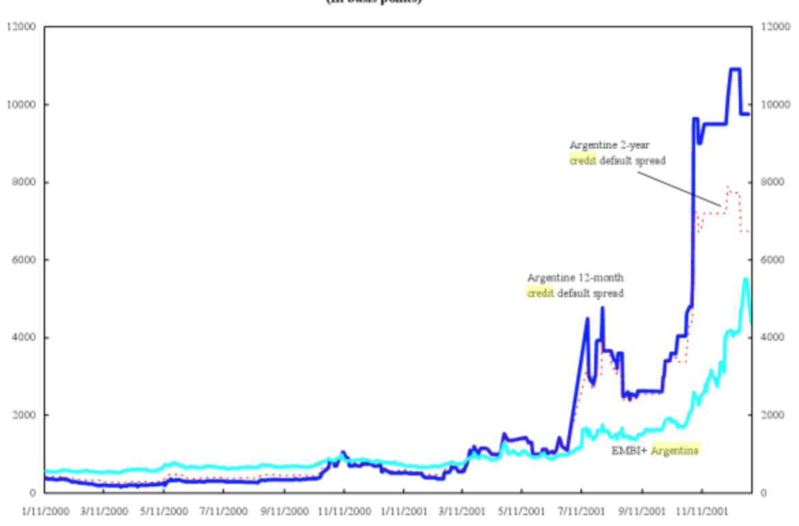
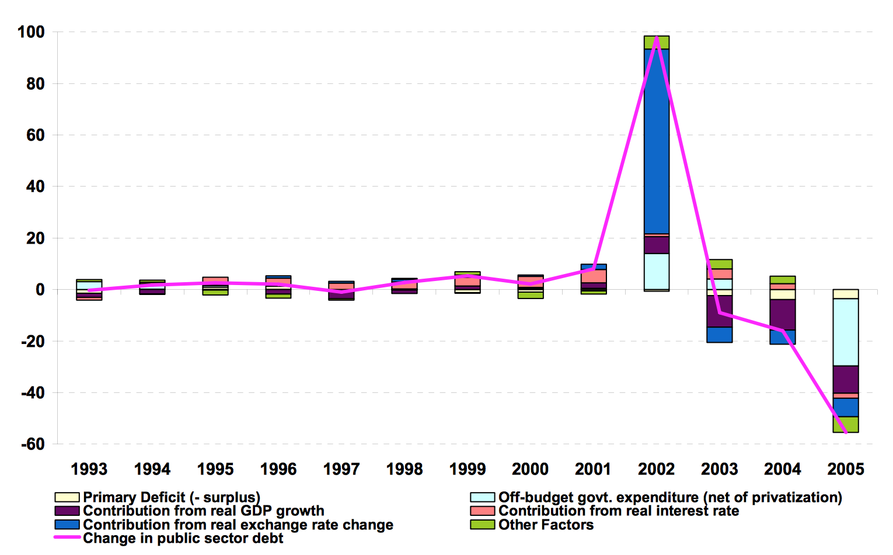

```{r setup, include=FALSE}
knitr::opts_chunk$set(echo = FALSE)
library(dplyr)
library(ggplot2)
library(ggthemes)
```

```{r General Settings }
images <- '/Users/andresp/Desktop/'

data <- read.csv('data.csv') %>% tbl_df() %>%
  mutate(date = as.Date(date))
```

```{r case Argentina}
case_data <- data %>% filter(name == 'Argentina')

```

Argentina 2001
---------------

## Por qué es un activo estratégico

Argentina es un mercado grande con alto crecimiento demográfico y es  un importante  proveedor de commodities. Su PBI está por encima del PBI promedio del mundo (es el tercero de Latinoamérica). Además es el país #8 en superficie  y el #32 en cantidad de habitantes del mundo. Su inestabilidad amenaza al sistema económico latinoamericano y por lo tanto a los mercados emergentes.

## Por qué es un activo inestable

Las instituciones argentinas son extractivas. La libertad económica es muy baja y la concentración de riesgo es muy alta. Tiene un track record de no respetar contratos.

### Complejidad económica


  
  

Más del 50% de las exportaciones son de productos minerales o animales con poco valor agregado. 60% de lo que exporta va a países emergentes, con concentración en Brasil y China.

  

  


### Libertad económica

  


  

### Monitoreo de indicadores

##### Excange rate: 
El tipo de cambio fijo se rompe, produciendo una devaluación.




##### CDS: 
El seguro de default de Argentina es bajo al igual que todos los de la región. Esto producto de las acciones anticíclicas de los mercados desarrollados para evitar un contagio de la crisis asiática y la crisis de las 'dot-com'.



##### Endeudamiento: 
Antes de la crisis el endeudamiento sube a fines de la década del 90. La deuda se dispara por el cambio en el tipo de cambio real.




### Valor duro de los activos

El price to book de las acciones argentinas es en general 1.5x

```{r argie pb}
ggplot(case_data %>% filter(unique_variable == 'Argentina PB'),
       aes(date,value)) + geom_line() + theme_wsj(color = 'white') +
  theme(plot.title = element_text(size = 14)) +
  ggtitle('Price to book Argentina')
```


Durante la crisis el  price to book está por debajo de 1x

```{r argie pb en crisis}
ggplot(case_data %>% filter(unique_variable == 'Argentina PB',
                            date > "2000-09-04" & date <"2004-09-18"),
       aes(date,value)) + geom_line() + theme_wsj(color = 'white') +
  theme(plot.title = element_text(size = 14)) +
  ggtitle('Price to book Argentina')

``` 


### Retorno de la inversión

Como el punto de entrada no es preciso, calculamos distintos retorno para diferentes puntos de entrada y puntos de salida.

```{r argie returns}
case_return_vars <- c('TR_1y', 'TR_3y','TR_5y')
ggplot(case_data %>% filter(variable %in% case_return_vars,
                            date > "2000-09-04" & date <"2004-09-18"),
       aes(date,value, color = variable)) + 
  geom_line() + theme_wsj(color = 'white') +
  theme(plot.title = element_text(size = 14), legend.title = element_blank()) +
  ggtitle('Retorno de la situación especial Argentina 2001')
```

En este gráfico se ve el retorno de la inversión a 1, 3 y 5 años. Este gráfico se lee así: 'si entré en el 2002, un año después estoy perdiendo plata (la línea roja está debajo de cero). Tres años después (línea verde) estoy arriba (1x). Cinco años después (línea azul ) el trade multiplicó por 2.5x'.

Esperando a que el price to book esté debajo de 1x - y un poco más el retorno es bastante bueno porque la opcionalidad tuvo un precio bajo.el mínimo de price to book fue menor a 0.5x y la re-estructuración de deuda fue el salvataje del sistema financiero. En el medio, el paradigma de Argentina como pais viable sufrió grandes dudas y la certeza de que desapareciera su valor fue muy alta.


